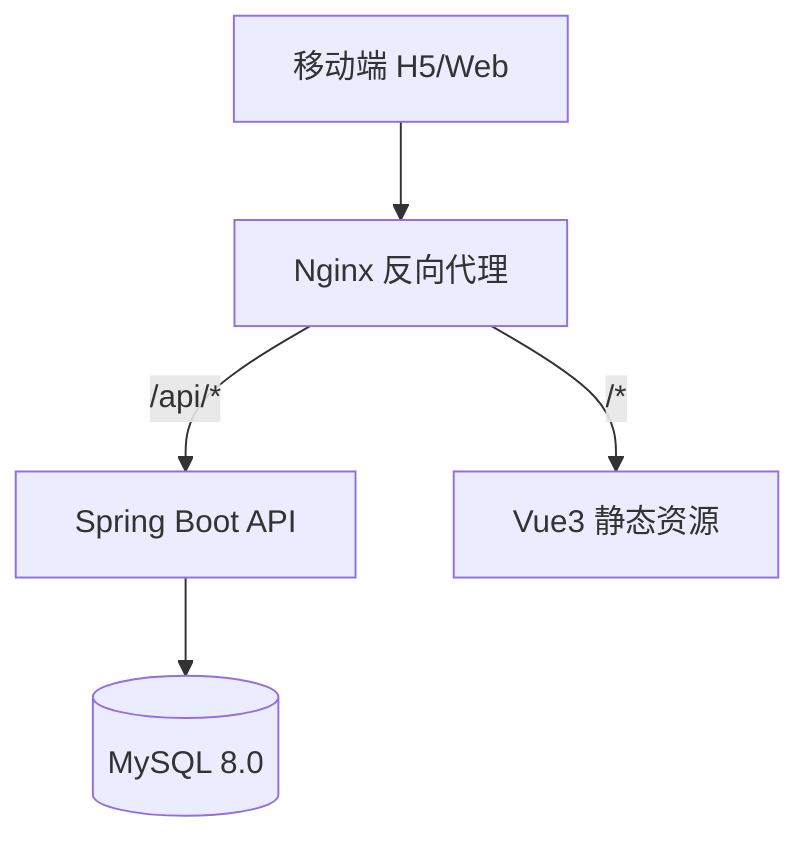
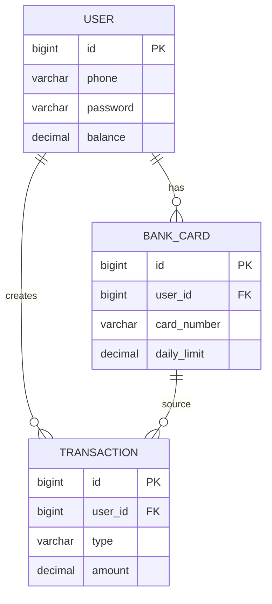
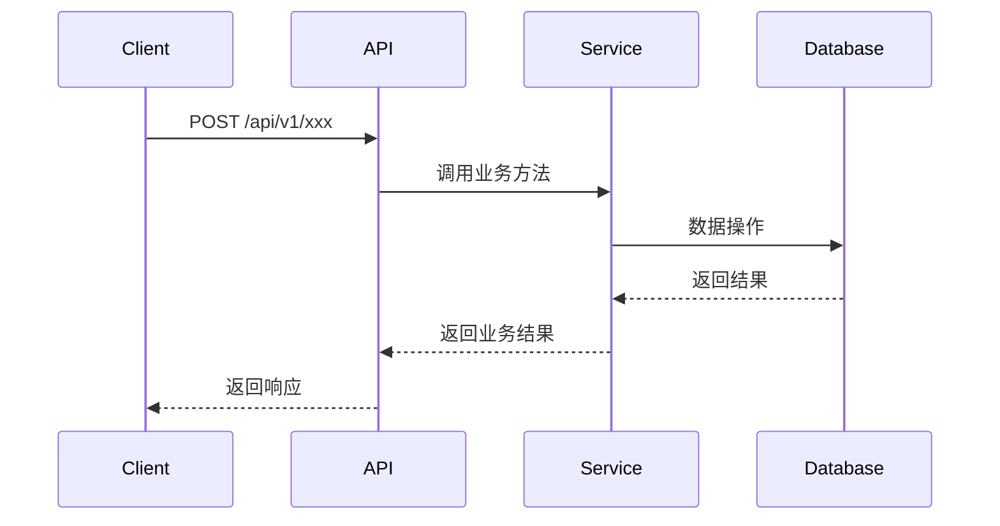

# 设计文档模板

## 文档信息

| 项目 | 内容 |
|------|------|
| 项目名称 | M-Bank 简易手机银行系统 |
| 模块名称 | [模块名] |
| 版本 | v1.0 |
| 编写日期 | [日期] |
| 编写方式 | AI 原生（architect Agent） |

## 1. 架构设计

### 1.1 系统架构图

### 1.2 模块划分

| 模块 | 职责 | 关键类 |
|------|------|--------|
| [模块名] | [职责描述] | [关键类列表] |

### 1.3 技术选型

| 层次 | 技术 | 版本 | 说明 |
|------|------|------|------|
| [层次] | [技术] | [版本] | [选型理由] |

## 2. 数据模型

### 2.1 ER 关系图

### 2.2 表结构

#### [表名]

| 字段名 | 类型 | 约束 | 说明 |
|--------|------|------|------|
| id | BIGINT | PK, AUTO_INCREMENT | 主键 |
| [字段名] | [类型] | [约束] | [说明] |

### 2.3 索引设计

| 表名 | 索引名 | 字段 | 类型 | 说明 |
|------|--------|------|------|------|
| [表名] | [索引名] | [字段] | UNIQUE/NORMAL | [说明] |

## 3. API 设计

参见 `mbank-docs/api/api-spec.md`

## 4. 安全设计

### 4.1 认证方案

[JWT 认证流程描述]

### 4.2 数据加密

[敏感数据加密方案]

### 4.3 审计日志

[操作审计方案]

## 5. 交互流程

### 5.1 [核心流程名]

## 6. 设计完整性自检

- [ ] 每个用户故事都有对应的 API 接口
- [ ] 每个业务实体都有对应的数据表
- [ ] 认证鉴权方案已覆盖所有接口
- [ ] 审计日志方案已覆盖所有资金操作
- [ ] 异常场景已有处理方案
