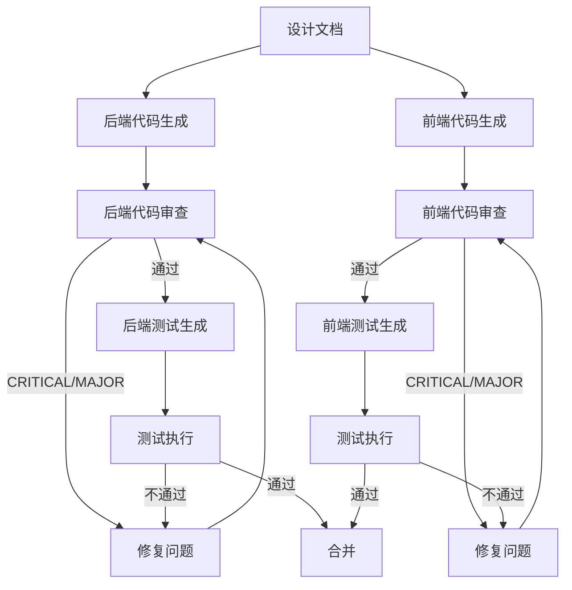

# 编码流程 - Coding Flow

## 流程概述

AI 驱动的编码流程，包含代码生成、代码审查和质量门禁。

## 流程图



## 执行步骤

### Step 1: 后端代码生成

使用 `/generate-api` Skill，按层生成：
1. Entity 层 -> 2. Repository 层 -> 3. DTO 层 -> 4. Service 层 -> 5. Controller 层 -> 6. Security 层

每层生成后立即检查编译。

### Step 2: 前端代码生成

使用 `/generate-frontend` Skill，按层生成：
1. API 层 -> 2. Store 层 -> 3. Router 层 -> 4. Views 层 -> 5. Components 层 -> 6. Utils 层

### Step 3: 代码审查

使用 `/security-scan` Skill 进行审查：

审查顺序：
1. 安全漏洞（CRITICAL 优先）
2. 业务逻辑正确性
3. 编码规范合规
4. 代码质量

审查标准：
- CRITICAL 问题：必须立即修复，不允许继续
- MAJOR 问题：必须修复后才能合并
- MINOR 问题：建议修复，可酌情跳过
- INFO 问题：可选改进

### Step 4: 测试生成

使用 `/generate-test` Skill，分层生成：
1. Service 单元测试
2. Controller 集成测试
3. 安全测试
4. 前端组件测试

### Step 5: 质量门禁

| 检查项 | 标准 | 不通过处理 |
|--------|------|------------|
| 安全扫描 | 无 CRITICAL/MAJOR | 修复后重新扫描 |
| 编译 | 零错误 | 修复编译错误 |
| 测试 | 全部通过 | 修复失败测试 |
| 覆盖率 | >= 80% | 补充测试用例 |

## 代码生成规范

### 后端生成顺序

```
1. Entity (数据模型)
   -> 确认字段和关联关系正确

2. Repository (数据访问)
   -> 确认查询方法完整

3. DTO (数据传输)
   -> 确认请求/响应格式正确

4. Service (业务逻辑)
   -> 确认业务规则实现
   -> 确认事务管理正确
   -> 确认审计日志记录

5. Controller (API端点)
   -> 确认 URL 和 HTTP 方法正确
   -> 确认参数验证完整

6. Security (安全配置)
   -> 确认 JWT 配置
   -> 确认认证过滤器
   -> 确认 CORS 配置
```

### 前端生成顺序

```
1. Utils (工具类)
   -> request 实例、Token 管理、格式化工具

2. API (接口调用)
   -> 对齐后端 API 规格

3. Store (状态管理)
   -> 定义状态和 Actions

4. Router (路由)
   -> 定义路由和守卫

5. Components (公共组件)
   -> 可复用的 UI 组件

6. Views (页面)
   -> 对齐设计稿
   -> 调用 Store 和 API
```
