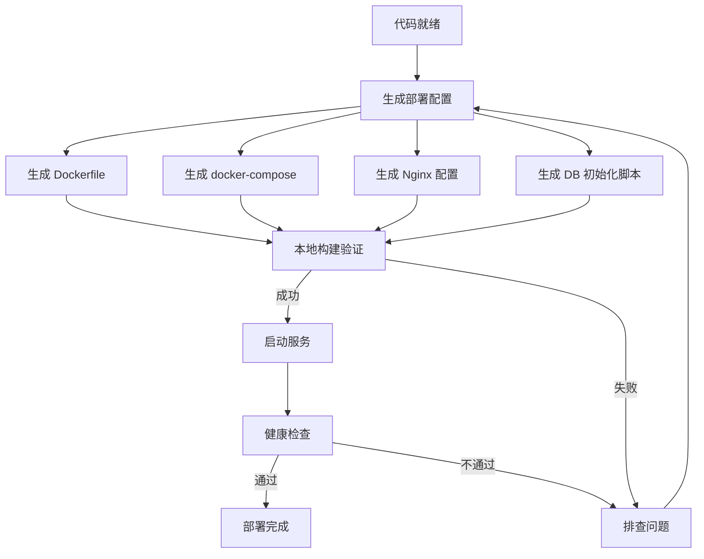

# 部署流程 - Deploy Flow

## 流程概述

AI 驱动的部署流程，从代码到生产环境的自动化部署。

## 流程图



## 执行步骤

### Step 1: 生成部署配置

使用 `/deploy-assist` Skill 生成：
1. 后端 Dockerfile（多阶段构建）
2. 前端 Dockerfile（Nginx 服务）
3. docker-compose.yml
4. Nginx 配置
5. 数据库初始化脚本
6. 环境配置文件

### Step 2: 本地构建验证

```bash
# 构建后端
cd mbank-backend
mvn clean package -DskipTests

# 构建前端
cd mbank-frontend
npm install
npm run build

# 启动 Docker Compose
docker-compose up -d
```

### Step 3: 健康检查

验证所有服务正常：
```bash
# 检查后端健康
curl http://localhost:8080/actuator/health

# 检查前端
curl http://localhost:80

# 检查数据库
docker exec mbank-mysql mysql -u root -p -e "SHOW DATABASES"
```

### Step 4: 冒烟测试

部署后执行关键业务验证：
- [ ] 用户注册
- [ ] 用户登录
- [ ] 绑定银行卡
- [ ] 转账
- [ ] 查询交易流水

## 环境配置

### 开发环境 (dev)

| 配置项 | 值 |
|--------|------|
| DB_HOST | localhost |
| DB_PORT | 3306 |
| JWT_SECRET | dev-secret-key-256bit |
| LOG_LEVEL | DEBUG |
| SERVER_PORT | 8080 |

### 生产环境 (prod)

| 配置项 | 值 |
|--------|------|
| DB_HOST | ${DB_HOST} |
| DB_PORT | ${DB_PORT} |
| JWT_SECRET | ${JWT_SECRET} |
| LOG_LEVEL | WARN |
| SERVER_PORT | 8080 |

## 回滚策略

1. **Docker 镜像回滚**：保留前一个版本的镜像，回滚时切换镜像标签
2. **数据库回滚**：执行逆向迁移脚本（如有 Schema 变更）
3. **配置回滚**：保留前一个版本的配置文件

```bash
# 回滚到上一个版本
docker-compose down
docker tag mbank-backend:latest mbank-backend:rollback
docker tag mbank-backend:prev mbank-backend:latest
docker-compose up -d
```

## 监控验证

部署完成后检查：
- [ ] 健康检查端点返回 UP
- [ ] 关键 API 响应时间 < 500ms
- [ ] 无 ERROR 级别日志
- [ ] 数据库连接正常
