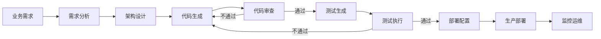

# 端到端研发流程 - E2E Flow

## 流程概述

M-Bank 端到端 AI 原生研发流程，从业务需求到生产部署的全链路 AI 驱动闭环。

## 流程图

## 阶段详情

### Phase 1: 需求分析

**负责人**：requirement-analyst Agent
**输入**：业务需求描述
**输出**：结构化需求文档
**质量门禁**：需求完整性检查

执行步骤：
1. 解析业务需求，提取功能点和非功能需求
2. 按 INVEST 原则拆分用户故事
3. 为每个用户故事编写 Given-When-Then 验收标准
4. 标注优先级和模块间依赖
5. 需求完整性自检

**触发命令**：`/requirement-to-design mbank-docs/requirements/`

### Phase 2: 架构设计

**负责人**：architect Agent
**输入**：需求文档
**输出**：架构设计、数据模型、API 规格文档
**质量门禁**：设计完整性检查

执行步骤：
1. 基于需求设计系统架构
2. 设计数据模型（ER 图 + 表结构）
3. 设计 RESTful API 接口
4. 设计安全方案
5. 设计核心交互流程
6. 设计完整性自检

### Phase 3: 代码生成

**负责人**：generate-api Skill + generate-frontend Skill
**输入**：设计文档
**输出**：前后端代码
**质量门禁**：编译通过

执行步骤：
1. 后端代码生成（Entity -> Repository -> DTO -> Service -> Controller -> Security）
2. 前端代码生成（API -> Store -> Router -> Views -> Components -> Utils）
3. 编译验证

**触发命令**：
- `/generate-api mbank-docs/design/`
- `/generate-frontend mbank-docs/design/`

### Phase 4: 代码审查

**负责人**：code-reviewer Agent
**输入**：生成的代码
**输出**：审查报告
**质量门禁**：无 CRITICAL/MAJOR 问题

执行步骤：
1. 安全漏洞扫描
2. 规范合规检查
3. 代码质量评估
4. 业务逻辑审查
5. 生成审查报告
6. 修复问题后重新审查

**触发命令**：`/security-scan mbank-backend/`

### Phase 5: 测试生成

**负责人**：test-generator Agent
**输入**：代码 + 需求文档
**输出**：测试代码
**质量门禁**：核心业务覆盖率 >= 80%

执行步骤：
1. 分析测试目标
2. 生成单元测试
3. 生成集成测试
4. 生成安全测试
5. 覆盖率分析

**触发命令**：`/generate-test mbank-backend/src/main/java/com/mbank/`

### Phase 6: 部署

**负责人**：devops Agent
**输入**：项目代码
**输出**：部署配置
**质量门禁**：所有服务健康

执行步骤：
1. 生成 Dockerfile
2. 生成 docker-compose.yml
3. 生成 Nginx 配置
4. 生成数据库初始化脚本
5. 生成环境配置
6. 健康检查验证

**触发命令**：`/deploy-assist`

## 关键指标

| 指标 | 目标 |
|------|------|
| 需求到代码的转化时间 | < 2 小时 |
| 代码审查通过率 | >= 90% |
| 测试覆盖率 | >= 80% |
| 部署成功率 | >= 95% |
