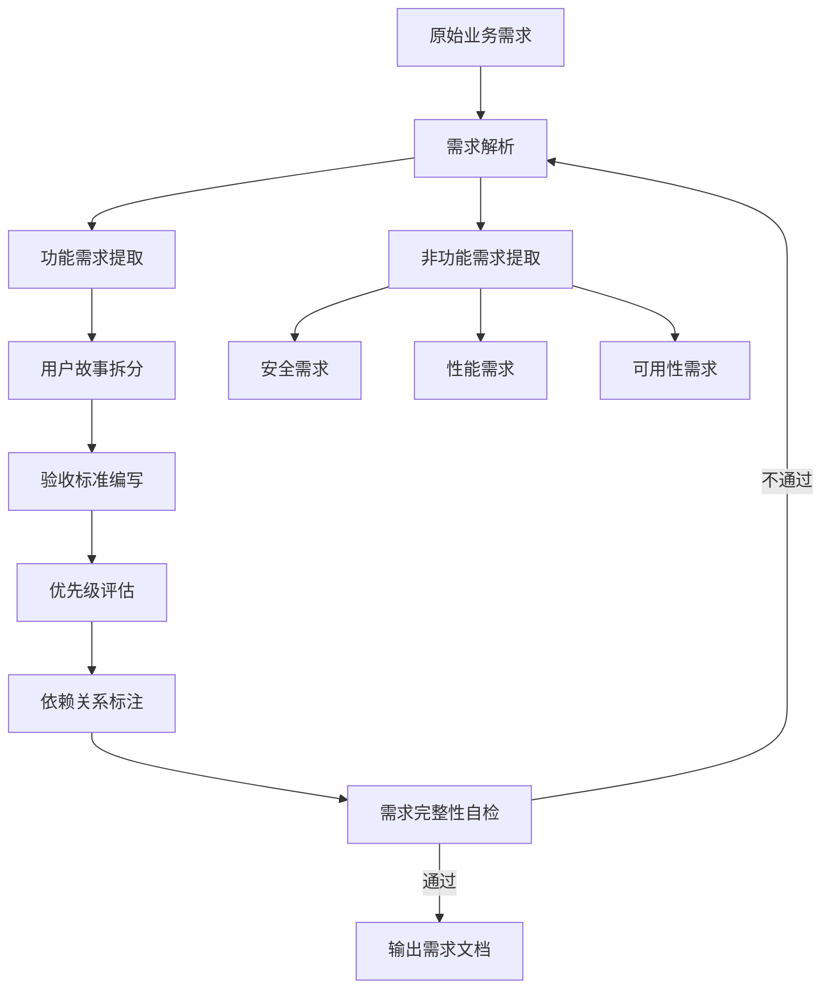

# 需求处理流程 - Requirement Flow

## 流程概述

将原始业务需求转化为可执行的结构化需求文档，是整个研发流程的起点。

## 流程图



## 执行步骤

### Step 1: 需求解析

- 阅读原始业务需求
- 识别核心业务实体
- 梳理业务流程

### Step 2: 功能需求提取

- 按模块提取功能点
- 识别 CRUD 操作
- 识别业务规则

### Step 3: 非功能需求提取

- 安全需求（认证、加密、审计）
- 性能需求（响应时间、并发量）
- 可用性需求（移动端适配）

### Step 4: 用户故事拆分

按 INVEST 原则拆分：
- **I**ndependent：独立的
- **N**egotiable：可协商的
- **V**aluable：有价值的
- **E**stimable：可估算的
- **S**mall：小的
- **T**estable：可测试的

### Step 5: 验收标准编写

使用 Given-When-Then 格式：
```
Given [前置条件]
When [用户操作]
Then [预期结果]
```

### Step 6: 优先级评估

| 优先级 | 标准 | 示例 |
|--------|------|------|
| P0 | 核心功能，无替代方案 | 用户登录、转账 |
| P1 | 重要功能，有替代方案 | 缴费、限额设置 |
| P2 | 改善体验 | 操作历史、快捷操作 |

### Step 7: 需求完整性自检

- [ ] 每个功能点都有用户故事
- [ ] 每个用户故事都有验收标准
- [ ] 非功能需求已覆盖
- [ ] 异常场景已识别
- [ ] 依赖关系已标注

## 输出

- `mbank-docs/requirements/需求文档V1.3.md`（主文档，包含全部模块需求）

## 需求文档结构

主文档按以下模块组织：1. 注册与开户（§8.0）2. 登录与账户管理（§8.1）3. 账户与银行卡管理（§8.2）4. 交易与查询（§8.3）5. 安全与风控策略（§9）
