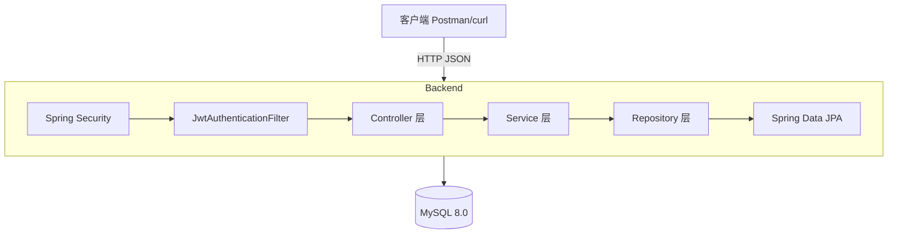

# 架构设计文档 - 认证模块 MVP

## 文档信息

| 项目 | 内容 |
|------|------|
| 项目名称 | M-Bank 简易手机银行系统 |
| 模块名称 | 认证模块（注册、登录、用户信息、修改密码） |
| 版本 | v1.0 |
| 编写日期 | 2026-05-17 |
| 编写方式 | AI 原生（architect Agent） |
| 需求来源 | 需求文档V1.3 §8.0 注册与开户、§8.1 登录与账户状态管理 |

## 1. 架构设计

### 1.1 系统架构图



### 1.2 模块划分

| 模块 | 职责 | 关键类 |
|------|------|--------|
| entity | JPA 实体映射 | User, Account, AuditLog |
| repository | 数据访问层 | UserRepository, AccountRepository, AuditLogRepository |
| dto.request | 请求参数封装与校验 | RegisterRequest, LoginRequest, ChangePasswordRequest |
| dto.response | 统一响应封装 | ApiResponse, LoginResponse, UserResponse |
| service | 业务逻辑层 | UserService/UserServiceImpl, AuditLogService/AuditLogServiceImpl |
| controller | REST 接口层 | AuthController, UserController |
| security | JWT 认证与过滤 | JwtUtil, JwtAuthenticationFilter |
| config | 安全与跨域配置 | SecurityConfig, CorsConfig |
| exception | 统一异常处理 | BusinessException, GlobalExceptionHandler |

### 1.3 技术选型

| 层次 | 技术 | 版本 | 说明 |
|------|------|------|------|
| 框架 | Spring Boot | 3.2.5 | RESTful API 主框架 |
| 语言 | Java | 17 | LTS 版本 |
| ORM | Spring Data JPA | 随 Boot | Hibernate 实现，天然防 SQL 注入 |
| 安全 | Spring Security | 随 Boot | 认证过滤链、密码编码器 |
| JWT | jjwt | 0.12.5 | Token 生成与验证 |
| 数据库 | MySQL | 8.0+ | 关系型持久化 |
| 迁移 | Flyway | 随 Boot | 数据库版本管理 |
| 校验 | Jakarta Validation | 随 Boot | JSR-303 参数校验 |
| 工具 | Lombok | 随 Boot | 减少样板代码 |

### 1.4 包结构

```
com.mbank
├── MBankApplication.java          # 应用入口
├── entity/                        # JPA 实体
│   ├── User.java
│   ├── Account.java
│   └── AuditLog.java
├── repository/                    # 数据访问
│   ├── UserRepository.java
│   ├── AccountRepository.java
│   └── AuditLogRepository.java
├── dto/
│   ├── request/                   # 请求 DTO
│   │   ├── RegisterRequest.java
│   │   ├── LoginRequest.java
│   │   └── ChangePasswordRequest.java
│   └── response/                  # 响应 DTO
│       ├── ApiResponse.java
│       ├── LoginResponse.java
│       └── UserResponse.java
├── service/                       # 业务接口
│   ├── UserService.java
│   ├── AuditLogService.java
│   └── impl/                     # 业务实现
│       ├── UserServiceImpl.java
│       └── AuditLogServiceImpl.java
├── controller/                    # REST 控制器
│   ├── AuthController.java
│   └── UserController.java
├── security/                      # 安全组件
│   ├── JwtUtil.java
│   └── JwtAuthenticationFilter.java
├── config/                        # 配置类
│   ├── SecurityConfig.java
│   └── CorsConfig.java
└── exception/                     # 异常处理
    ├── BusinessException.java
    └── GlobalExceptionHandler.java
```

## 2. 数据模型

参见 `mbank-docs/design/data-model.md`

## 3. API 设计

参见 `mbank-docs/api/api-spec.md`

## 4. 安全设计

### 4.1 认证方案

- 认证方式：JWT Bearer Token（HS256）
- 密钥长度：>= 256 位（Base64 编码存储于 application.yml）
- Token 有效期：24 小时
- Token 载荷：userId（subject）、phone（自定义 claim）、issuedAt、expiration
- Token 传递：请求头 `Authorization: Bearer <token>`

**认证流程**：
1. 用户登录成功 -> 服务端生成 JWT -> 返回客户端
2. 客户端后续请求携带 JWT -> JwtAuthenticationFilter 拦截验证
3. 验证通过 -> 将 userId 设入 SecurityContext -> 业务方法通过 Authentication 获取

**Token 失效策略（MVP）**：
- User 实体增加 `passwordChangedAt` 字段
- 修改密码后更新此字段为当前时间
- JwtAuthenticationFilter 验证时检查 token 的 issuedAt 是否早于 passwordChangedAt
- 早于则拒绝（等效于失效所有旧 token），无需 Redis

### 4.2 密码安全

- 存储方式：BCrypt 哈希（强度因子 = 10）
- 强度要求：>= 8 位，包含大写字母、小写字母、数字中的至少两种
- 登录错误锁定：连续 5 次错误 -> LOCKED_TEMP 状态 15 分钟
- 锁定过期：登录时懒检查（无需定时任务）

### 4.3 鉴权规则

| 路径 | 规则 |
|------|------|
| /api/v1/auth/** | permitAll（允许匿名访问） |
| /api/v1/users/** | authenticated（需要 JWT） |
| 其他 | authenticated |

### 4.4 数据脱敏

| 数据类型 | 存储方式 | 展示方式 |
|----------|----------|----------|
| 密码 | BCrypt 哈希 | 不展示 |
| 手机号 | 明文存储 | 138****8000 |

### 4.5 审计日志

所有关键操作必须记录审计日志：

| 操作 | action 值 | detail 内容 |
|------|-----------|-------------|
| 用户注册 | REGISTER | {"phone":"138****8000"} |
| 登录成功 | LOGIN | {"userId":1} |
| 登录失败 | LOGIN_FAILED | {"phone":"138****8000","attempt":3} |
| 账户锁定 | ACCOUNT_LOCKED | {"userId":1,"lockedUntil":"..."} |
| 修改密码 | CHANGE_PASSWORD | {"userId":1} |

审计日志使用独立事务（REQUIRES_NEW），确保业务回滚不丢失审计记录。

## 5. 交互流程

参见 `mbank-docs/design/interaction-flow.md`

## 6. 设计完整性自检

- [x] 每个用户故事都有对应的 API 接口（注册、登录、获取用户信息、修改密码）
- [x] 每个业务实体都有对应的数据表（t_user, t_account, t_audit_log）
- [x] 认证鉴权方案已覆盖所有接口（/auth/** permitAll, 其余 authenticated）
- [x] 审计日志方案已覆盖所有操作（注册、登录、登录失败、锁定、改密）
- [x] 异常场景已有处理方案（GlobalExceptionHandler 统一处理）
- [x] Token 失效策略已设计（passwordChangedAt 比对）
- [x] 密码安全策略已设计（BCrypt + 强度校验 + 错误锁定）
