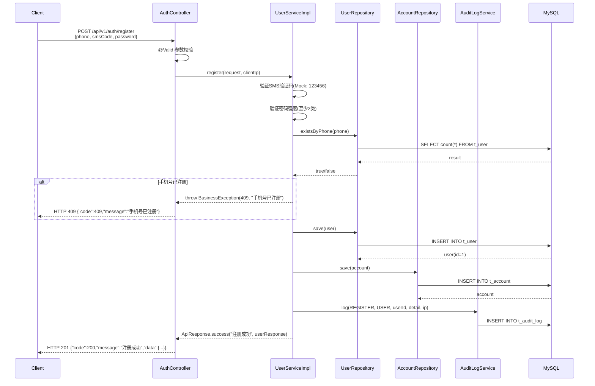
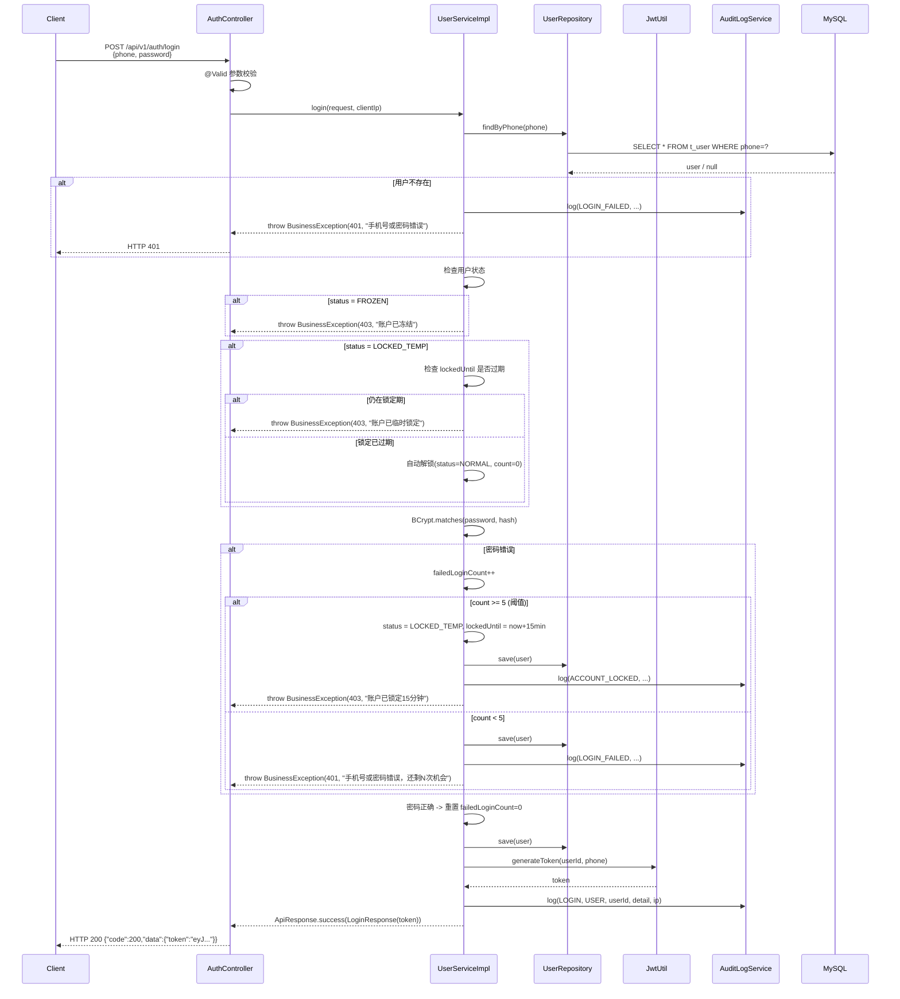
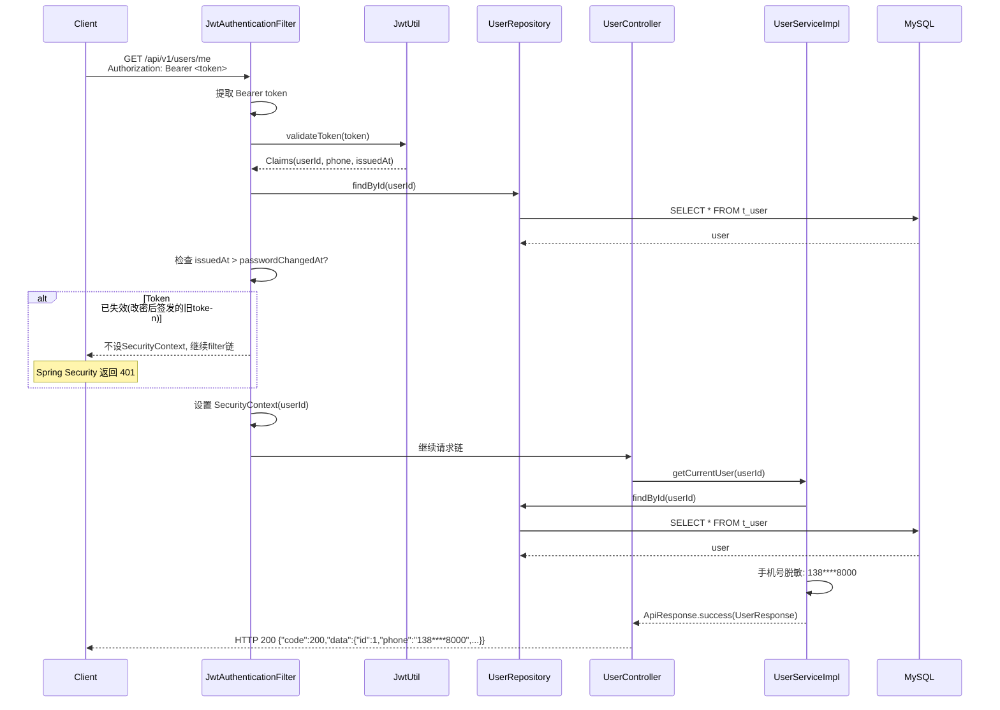
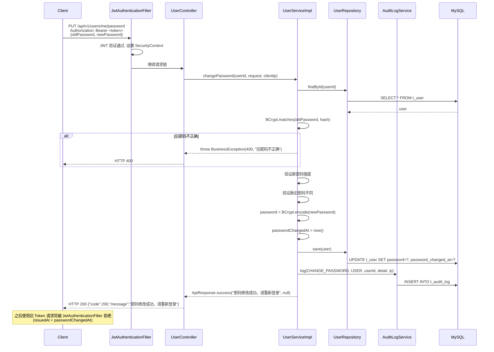
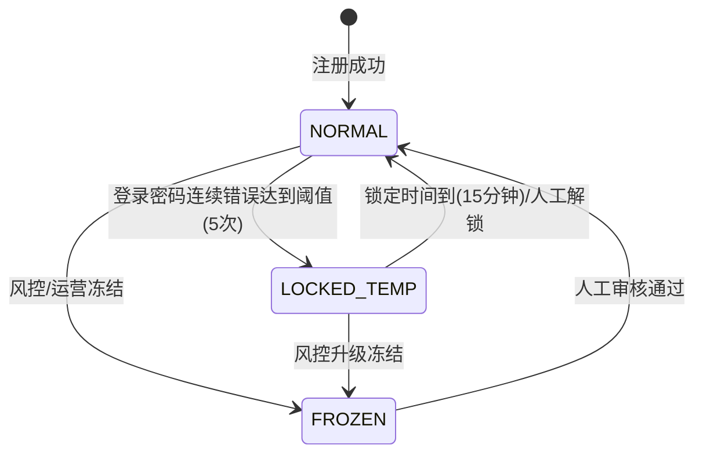

# 交互流程设计 - 认证模块 MVP

## 文档信息

| 项目 | 内容 |
|------|------|
| 项目名称 | M-Bank 简易手机银行系统 |
| 模块名称 | 认证模块 |
| 版本 | v1.0 |
| 编写日期 | 2026-05-17 |
| 编写方式 | AI 原生（architect Agent） |

## 1. 用户注册流程

## 2. 用户登录流程

## 3. 获取当前用户信息流程

## 4. 修改密码流程

## 5. 用户状态流转图

