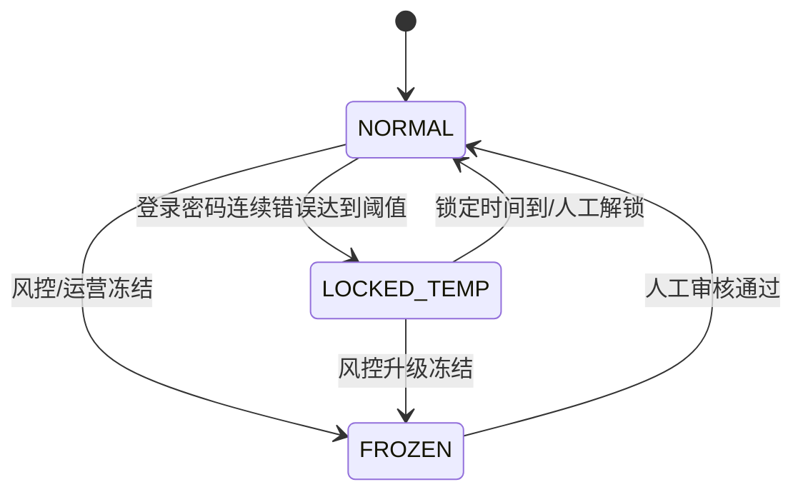
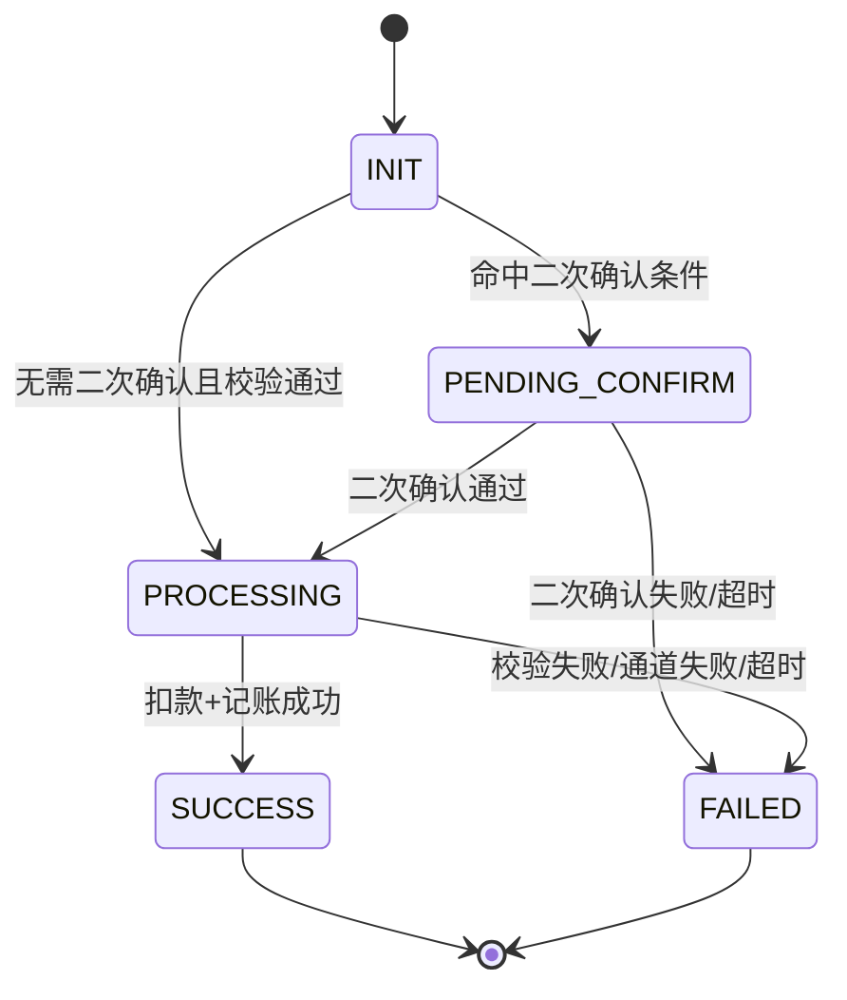
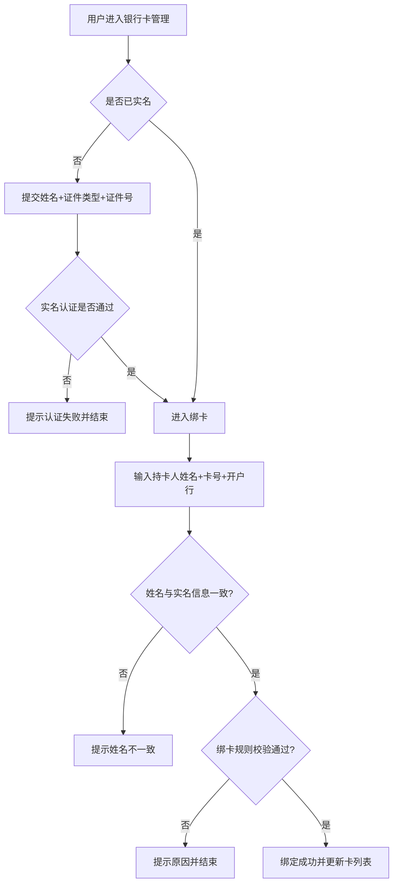
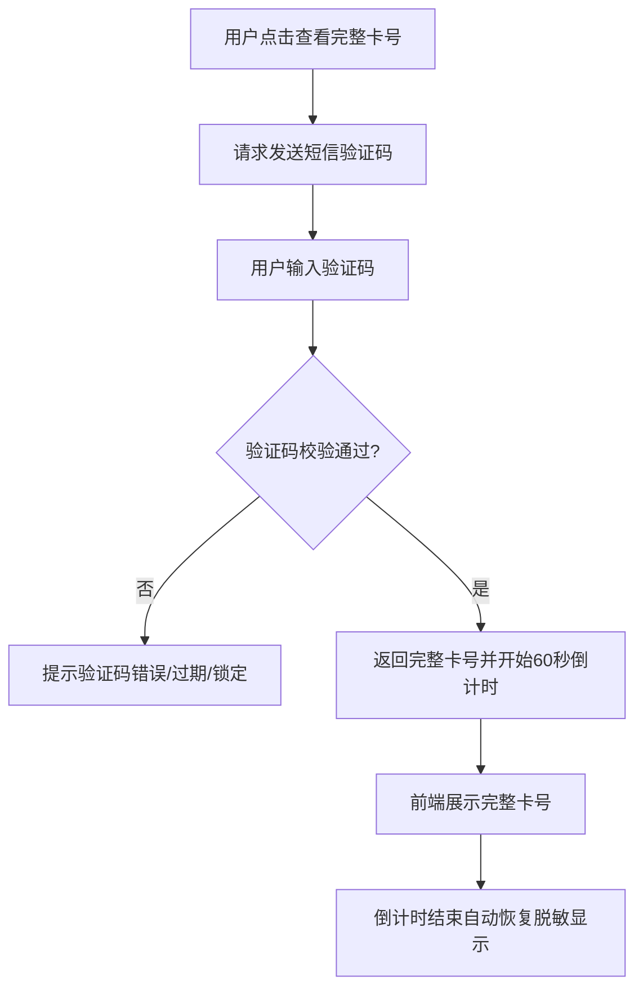
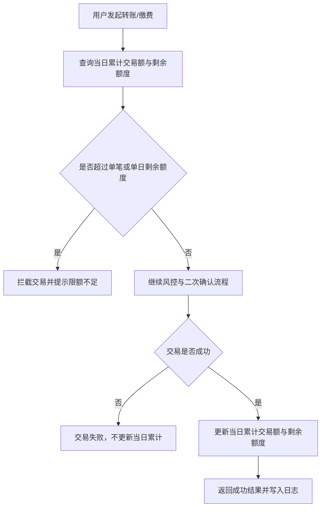
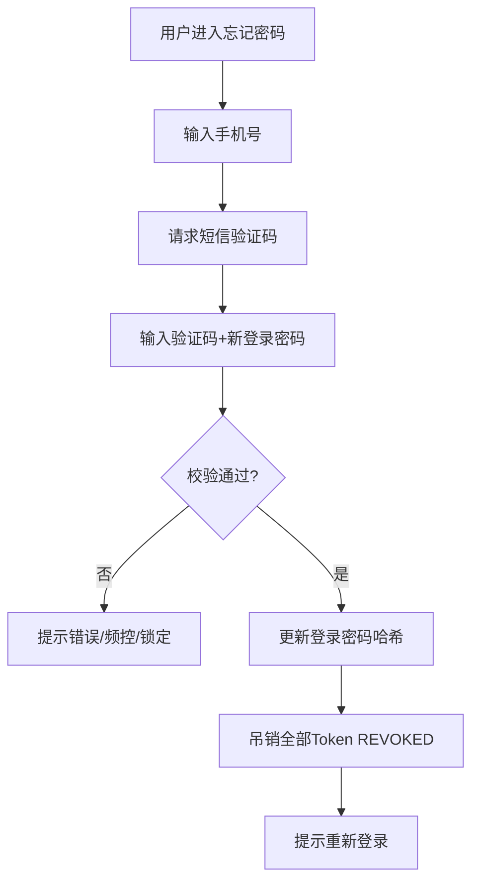
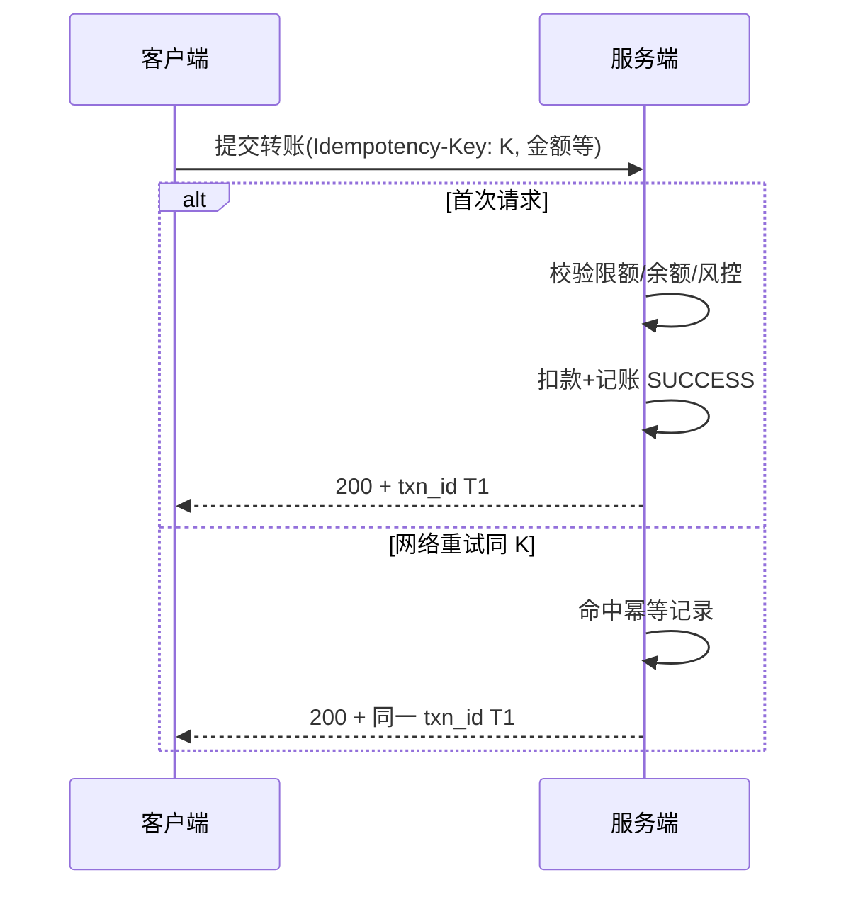

# 简易手机银行核心业务需求文档（V1.3）

## 1. 文档信息

### 1.1 基本信息
- **文档名称**：简易手机银行核心业务需求文档（需求分析版）
- **文档版本**：V1.3
- **文档状态**：需求分析与评审版
- **适用角色**：产品经理、架构师、后端工程师、前端工程师、测试工程师、项目经理
- **版本说明**：在 V1.2 基础上合并《V1.3 增补大纲》全部采纳项：补充文档治理、注册与密码闭环、数据字段与幂等、权限矩阵、依赖与 Mock、错误码与 NFR、数据留存与验收清单；状态流转图增补密码重置与转账幂等交互说明。

### 1.2 修订记录

| 版本 | 日期       | 变更摘要                         | 作者 | 评审 |
|------|------------|----------------------------------|------|------|
| V1.1 | （继承）   | 初始较全量版本                   | —    | —    |
| V1.2 | （继承）   | 精简为前 9 章并补充流程图        | —    | —    |
| V1.3 | 2026-05-06 | 按增补大纲完善全文（本版）       | —    | 待填 |

### 1.3 关键决策（ADR 简表）

| 编号 | 决策主题           | 结论（本期） |
|------|--------------------|--------------|
| D1   | 外部系统对接方式   | 短信、实名/验卡、缴费等默认 **Mock 渠道**；可切换为真实对接而不改业务规则表述 |
| D2   | 幂等策略           | 转账/缴费提交须带 **幂等键**；服务端按 user_id + idempotency_key 去重，重复请求返回与原请求一致的业务结果与同一 txn_id（若已成功） |
| D3   | 自然日与限额统计   | 以 **服务器时区** 自然日 00:00:00–23:59:59 为准；跨时区用户仍按服务器日历 |
| D4   | 交易终态           | 本期不设「渠道超时待核实」子状态；**PROCESSING** 在超时或失败时进入 **FAILED**；不设人工改态入口（演示环境可通过脚本订正数据，非产品能力） |
| D5   | 管理端             | **本期无运营/客服 Web 管理端**；用户冻结/解锁、人工解锁临时锁定通过 **脚本或预留内部接口** 完成 |

## 2. 专有名词解释

- **MVP（Minimum Viable Product）**：最小可行产品，用最小功能集合验证核心业务价值。
- **PRD（Product Requirements Document）**：产品需求文档，用于明确产品目标、范围、规则、流程与验收基线。
- **Token**：用于标识用户登录态的凭证。
- **幂等（Idempotency）**：同一请求重复提交时，系统只产生一次有效业务结果。
- **幂等键（Idempotency Key）**：客户端生成的唯一字符串（建议 UUID），与同用户的资金类提交请求绑定，用于服务端去重。
- **状态机**：对象在多个状态之间按规则转移的模型。
- **风控**：通过规则识别并处理风险交易的机制（提示、拦截、升级校验）。
- **审计日志**：关键业务行为与安全事件留痕记录，用于追踪与审计。
- **实名认证**：验证用户姓名与证件信息真实性，并与银行卡信息一致的身份校验过程。
- **敏感信息**：涉及身份与资金安全的数据，如证件号码、完整银行卡号、手机号、验证码等。
- **当日累计交易额**：用户自然日内（00:00–23:59，服务器时区）所有成功出账交易金额之和。
- **渠道**：外部扣款、缴费、短信等能力的提供方（含银行核心、三方缴费、短信网关等）。
- **Mock 渠道**：本期用固定规则模拟返回值、错误码与可配置延迟的替代实现，用于联调与演示。
- **客户端设备标识（Device Fingerprint）**：由客户端生成的、用于识别终端实例的标识（可变更）；与 user_id 组合用于判定「新设备」。
- **错误码**：前后端与测试共用的业务错误编码，与 HTTP 状态及用户提示文案映射。
- **注册 / 开户**：注册指创建用户凭证；开户指为用户创建资金账户（Account），余额初始为 0。
- **冲正 / 对账**：冲正指交易记账后的反向调整；对账指与渠道账单核对。**本期不提供**用户侧冲正与对账能力。

## 3. 背景、目标与成功标准

### 3.1 背景
面向个人用户建设简易手机银行核心能力，覆盖注册登录、账户管理、银行卡管理、交易查询与基础安全，满足高频线上金融服务需求。

### 3.2 业务目标
- 建立「注册/登录 → 账户管理 → 交易 → 追踪」的基础闭环。
- 在保证可用性的前提下满足基础安全要求。
- 为后续扩展（更多支付场景、分层风控）预留能力边界。

### 3.3 成功标准（版本级）
- 核心流程完整可用：注册、登录、实名绑卡、余额查询、账单查询、转账、缴费、当日累计交易额查询。
- 交易安全可控：密码校验、限额控制、风险提示、二次确认覆盖关键交易。
- 隐私保护可落地：默认接口仅返回脱敏证件号/卡号；查看完整卡号需短信验证码。
- 限额透明可查：用户可查看当日累计交易额与当日剩余可用额度。
- **资金类接口幂等与账务一致**：重复提交不产生双扣、双记；幂等行为可通过用例验证（见 §15）。
- **关键路径 NFR 可验收**：满足 §12 中约定的基线（演示环境允许降级说明）。

## 4. 用户范围与范围边界

### 4.1 目标用户
- 个人用户（不含企业账户）。

### 4.2 本期 MVP 范围（必须实现）
- **注册与账号**：手机号注册、短信验证码、设置登录密码与交易密码；注册成功后自动创建 User 与 Account（余额 0）。
- **账户与登录**：登录、退出、登录态管理；修改登录密码、修改交易密码；忘记登录密码重置（短信验证）、忘记交易密码重置（短信验证 + 身份校验）。
- **账户与银行卡管理**：账户信息查看/修改、实名认证、银行卡绑定/解绑、默认卡设置；手机号变更（双通道验证）；邮箱修改（验证后生效）。
- **交易与查询**：余额查询、账单查询（分页与排序）、转账汇款、生活缴费、当日累计交易额查询。
- **安全与隐私**：密码校验、限额控制、风险提示、二次确认、敏感字段脱敏、日志留存、幂等提交、新设备判定与短信限流。

### 4.3 非本期范围（暂不实现）
- 理财、贷款、信用卡还款、跨境业务。
- 高级 AI 风控模型与**可视化**人工审核平台（人工解冻等通过脚本/内部接口，见 §1.3 D5）。
- OCR 自动识别证件。
- **独立「设备管理」页面**（设备指纹仅服务端记录用于风控，用户不可自助撤销设备）。
- 账单导出（PDF/Excel）、交易回单样式化邮寄。
- **退款、冲正、撤销** 等记账反向流程与银企对账产品化能力。
- 生物识别登录（指纹/Face ID）、图形验证码（可选后续迭代，本期不设硬性产品要求）。

### 4.4 依赖声明（与研发对齐）
- **短信**：本期默认 **Mock**（可配置成功率与延迟）；接口契约与真实网关一致，便于替换。
- **实名 / 验卡**：本期默认 **Mock**（校验姓名与证件格式及与绑卡姓名一致性规则由本系统执行；外部联网核查为 Mock）。
- **生活缴费渠道**：本期默认 **Mock**（根据户号规则返回成功/失败，不强制先查欠费）。
- **行内核心 / 支付**：本期无独立核心对接描述，扣款与记账在**本应用边界内**原子完成；若未来对接核心，幂等与状态机语义保持不变。

## 5. 角色与权限

### 5.1 用户侧角色
- **未登录用户**：仅可访问注册、登录、忘记密码、发送短信验证码等公开接口及对应页面。
- **已登录用户**：可访问账户、银行卡、交易与查询能力（受用户状态细分限制）。
- **风险锁定用户**：允许查询类操作（余额、账单、限额、卡列表脱敏信息等），**禁止**发起转账、缴费及修改交易密码等资金相关写操作。
- **临时锁定用户**：禁止登录（或登录后立即拒绝）；已颁发的 Token 一律 **REVOKED**；敏感操作均不可执行直至锁定期结束或人工解锁。
- **冻结用户（FROZEN）**：禁止一切资金变动与绑卡/解绑；允许只读查询的范围由实现决定，**建议**仅允许登录后查看提示信息与客服指引（若演示无客服，则展示静态说明）。

### 5.2 运营侧（本期）
- **本期无面向运营的 Web 管理端**；冻结/解锁、临时锁定人工解除通过 **内部脚本或预留内部 API** 完成，须记审计日志。

### 5.3 接口能力矩阵（摘要）

| 能力类型     | NORMAL | LOCKED_TEMP | FROZEN   | 风险锁定（登录后） |
|-------------|--------|-------------|----------|---------------------|
| 登录/注册   | ✓      | ✗（登录拒） | 见 §7.2  | —                   |
| 查询余额/账单/限额 | ✓ | ✗           | 只读*    | ✓                   |
| 转账/缴费   | ✓      | ✗           | ✗        | ✗                   |
| 绑卡/解绑   | ✓      | ✗           | ✗        | ✗                   |
| 修改登录密码 | ✓     | ✗           | ✗        | ✓（仅登录密码，若业务允许） |
| 修改/重置交易密码 | ✓  | ✗           | ✗        | ✗                   |

\* FROZEN 的只读范围以实现为准，须在验收中固定一种行为（建议：登录后仅展示冻结提示，不展示余额明细）。

## 6. 核心业务对象与数据定义（简版）

### 6.1 业务对象
- **User（用户）**：用户身份与状态信息。
- **UserIdentity（实名信息）**：姓名、证件类型、证件号（加密存储）。
- **Account（资金账户）**：余额、账户状态。
- **BankCard（银行卡）**：卡信息、默认卡、绑定状态。
- **Transaction（交易）**：转账/缴费交易主记录。
- **BillItem（账单）**：每笔资金变化流水记录。
- **RiskEvent（风险事件）**：风险触发记录。
- **AuditLog（审计日志）**：关键操作留痕。
- **DailyLimitSnapshot（当日限额快照）**：当日累计已用额度与剩余额度（逻辑对象，可由实时计算实现）。
- **UserDevice（用户设备，本期）**：记录 device_fingerprint 与 user_id 首次/最近出现时间，用于「新设备」判定；**无用户自助管理界面**。

### 6.2 关键字段（建议）
- **User**：user_id, mobile, mobile_verified_at, login_pwd_hash, trade_pwd_hash, status, failed_login_count, register_source, created_at。
- **UserIdentity**：user_id, real_name, id_type, id_no_cipher, id_no_masked, verified_at。
- **Account**：account_id, user_id, balance, status, updated_at。
- **BankCard**：card_id, user_id, card_no_cipher, card_no_masked, bank_name, is_default, status, bind_verified。
- **Transaction**：txn_id, user_id, type, amount, status, idempotency_key, channel_ref（渠道单号，Mock 可填内部流水）, fail_code, counterparty_masked（对手方摘要脱敏）, created_at, completed_at。
- **BillItem**：bill_id, account_id, txn_id, amount, balance_after, type, status, occurred_at。
- **DailyLimitSnapshot**：user_id, biz_date, daily_limit_amount, daily_used_amount, daily_remaining_amount, updated_at。
- **UserDevice**：user_id, device_fingerprint, first_seen_at, last_seen_at, trusted（预留，本期可恒为 false）。

## 7. 状态机定义（必须遵循）

### 7.1 用户状态机
- **状态**：NORMAL（正常）、LOCKED_TEMP（临时锁定）、FROZEN（冻结）。
- **转移规则**：
  - NORMAL → LOCKED_TEMP：登录密码连续错误达到阈值。
  - LOCKED_TEMP → NORMAL：锁定时长结束或人工解锁。
  - NORMAL / LOCKED_TEMP → FROZEN：风控或运营冻结。
  - FROZEN → NORMAL：人工审核通过（脚本/内部接口）。

### 7.2 登录态状态机与用户状态联动
- **状态**：VALID（有效）、EXPIRED（过期）、REVOKED（主动失效）。
- **转移规则**：
  - 登录成功创建 VALID。
  - 超时后 VALID → EXPIRED。
  - 主动退出或风控踢出后 VALID → REVOKED。
- **联动**：
  - 用户进入 **LOCKED_TEMP** 时：当前及同用户其他 **VALID** Token 立即 **REVOKED**。
  - 用户进入 **FROZEN** 时：所有 **VALID** Token 立即 **REVOKED**；后续登录 attempt 由业务规则拒绝并提示。
  - **修改登录密码**成功后：可选策略为踢出其他设备全部 Token（本期建议：**使该用户所有 Token REVOKED**，仅保留当前会话若前端重新签发——实现二选一，须在接口文档固定；**推荐**全部失效并要求重新登录）。

### 7.3 交易状态机
- **状态**：INIT（已创建）、PENDING_CONFIRM（待二次确认）、PROCESSING（处理中）、SUCCESS（成功）、FAILED（失败）。
- **转移规则**：
  - 创建交易 → INIT。
  - 触发二次确认 → PENDING_CONFIRM。
  - 校验通过 → PROCESSING。
  - 扣款与记账成功 → SUCCESS。
  - 任一校验失败或通道失败 → FAILED。
- **约束**：SUCCESS 与 FAILED 为终态。
- **本期补充**：PROCESSING 阶段若发生超时或 Mock 渠道返回失败，统一进入 **FAILED**；**不提供**「人工核实中」长期悬挂状态；用户侧 **不提供** 异步查单补状态接口（见 §8.3），演示环境以同步响应为准。

## 8. 详细功能需求

### 8.0 注册与开户
1) **注册**
   - 输入：手机号、短信验证码、登录密码（符合强度策略）、交易密码（与登录密码不同）。
   - 规则：手机号唯一；验证码校验通过后方可设置密码；注册成功后 mobile_verified_at 写入。
   - 输出：自动创建 User（NORMAL）、Account（余额 0、状态正常）。
2) **登录方式边界**
   - 本期仅支持「手机号 + 登录密码」登录；生物识别为非本期范围。

### 8.1 登录与账户状态管理
1) **登录**
   - 输入：手机号 + 登录密码。
   - 规则：校验密码、累计失败次数、达到阈值触发临时锁定（见 §9.1）。
   - 输出：登录态凭证与用户基础状态；服务端记录或更新 **UserDevice**（device_fingerprint 由客户端传入）。

2) **退出登录**
   - 当前登录态 **REVOKED**。

3) **登录态校验**
   - 账户、银行卡、交易相关接口均需校验登录态（VALID）。

4) **修改登录密码**
   - 输入：旧登录密码 + 新登录密码；或 **短信验证码 + 新登录密码**（二选一可配置，本期须至少支持一种）。
   - 成功后：按 §7.2 联动策略失效 Token；记审计日志。

5) **修改交易密码**
   - 输入：旧交易密码 + 新交易密码；或短信验证码 + 新交易密码（须验证身份）。
   - 成功后：记审计日志；不要求退出登录。

6) **忘记登录密码**
   - 流程：手机号 → 短信验证码 → 设置新登录密码。
   - 成功后：该用户所有 Token **REVOKED**；记审计日志。

7) **忘记交易密码**
   - 流程：登录态下 → 短信验证码 + 实名信息校验（姓名+证件后若干位或全量服务端比对）→ 设置新交易密码。
   - 成功后：记审计日志。

### 8.2 账户与银行卡管理
1) **账户信息管理**
   - 可查看：昵称、手机号、邮箱。
   - 可修改：昵称、邮箱（邮箱修改后建议发送验证邮件，**本期可用「邮箱 + 短信二次确认」简化**）。

2) **手机号变更**
   - 须验证 **原手机号验证码** + **新手机号验证码**；限制每日变更次数与短信频控（见 §9.5）。
   - 成功后更新 User.mobile，记审计日志。

3) **实名认证（绑卡前置）**
   - 首次绑卡前必须完成实名认证。
   - 输入：真实姓名、证件类型、证件号码。
   - 校验：证件格式合法、姓名与绑卡姓名一致（Mock 实名可通过规则表模拟）。

4) **实名信息修改**
   - **本期不允许**用户自助修改实名信息；错误操作走客服/运营脚本（非产品流程）。

5) **银行卡绑定**
   - 输入：持卡人姓名、卡号、开户行。
   - 规则：必须已完成实名认证；卡号格式合法；同一用户最多 5 张卡；首张卡自动设为默认卡。

6) **银行卡解绑**
   - 仅可解绑正常状态卡；默认卡需先切换；仅剩一张卡时不可解绑。

7) **默认卡设置**
   - 同一用户有且仅有一张默认卡。

8) **敏感信息展示与查看**
   - 卡列表、卡详情默认仅返回脱敏卡号；证件默认脱敏。
   - 查看完整卡号需短信验证码；展示 **60 秒** 后恢复脱敏（与 V1.2 一致）。

### 8.3 交易与查询
1) **余额查询**
   - 返回账户可用余额。

2) **账单查询**
   - 筛选：时间范围、交易类型、状态。
   - **默认时间范围**：最近 30 天（可配置）；**分页**：page_size 最大 50，按 occurred_at **倒序**。
   - **详情字段（最小集）**：bill_id、类型、金额、变动后余额、关联 txn_id、状态、时间、摘要（对手方脱敏）。

3) **当日累计交易额查询**
   - 用户可查看：当日累计交易额、当日限额、当日剩余额度。
   - 统计口径：仅统计当日 SUCCESS 的出账（转账、缴费）。
   - 时间口径：服务器时区自然日。

4) **转账汇款**
   - **收款方**：本期支持「收款银行卡号 + 收款人姓名」；**行内账号**若与卡号等价可配置，须在实现文档固定。
   - **户名校验**：姓名与收款账户 Mock 规则一致则通过，不一致则拒绝并 **FAILED**，提示「户名与账号不一致」类文案。
   - **手续费**：本期 **0 元**，界面展示「免手续费」。
   - **到账说明**：Mock 下为 **实时到账** 文案；实际失败时以 FAILED 为准。
   - **校验顺序**：登录态 → 账户状态 → 交易密码 → 余额 → 单笔限额 → 当日剩余额度 → 风险规则 → 二次确认（如需）→ **幂等校验** → 扣款与记账。
   - **幂等**：请求须带 `Idempotency-Key`（或 body 字段 idempotency_key）；重复请求返回相同结果，不得重复扣款。
   - 成功后更新当日累计；失败不增加累计。

5) **生活缴费**
   - 支持话费、水费、电费。
   - 流程：选择类型 → 输入户号/手机号 → 输入金额 → 安全校验（同转账链）→ 支付结果。
   - **查欠费**：**非必须**；户号不存在由 Mock 返回明确错误码（见 §11），用户可重试。
   - 成功口径与累计规则同转账。

6) **交易结果查询**
   - **本期不提供**用户侧「异步查单」接口；以提交接口同步返回终态或 PROCESSING 后短时内完成（演示环境可强制同步终态）。

## 9. 安全、隐私与风控策略（参数化）

### 9.1 密码策略
- 登录密码与交易密码分离，**不得相同**（注册与修改时校验）。
- 后端仅保存哈希+盐后的密码摘要。
- 登录连续失败阈值与锁定时长参数化（建议默认值在配置中心：如 5 次 / 15 分钟）。

### 9.2 限额策略
- 默认单笔限额：50,000 元。
- 默认单日累计限额：100,000 元。
- 超限交易必须拦截并提示。
- 限额信息查询至少返回：单笔限额、单日限额、当日已用额度、当日剩余额度。

### 9.3 风险规则（MVP）
- 单笔大额交易触发风险提示。
- 短时间高频交易触发风险提示。
- **新设备首次大额**：若该 user_id + device_fingerprint **首次**出现，且单笔金额 ≥ 参数化阈值（建议默认 5,000 元，可配置），则须 **二次确认**。
- 风险命中后须给用户明确反馈（提示/阻断/需二次确认）。

### 9.4 二次确认策略
- 命中高风险或高金额阈值须二次确认。
- MVP 确认方式：再次输入交易密码。

### 9.5 敏感数据保护策略
- 完整证件号、完整卡号后端加密存储。
- 普通查询接口禁止返回完整证件号与完整卡号。
- 查看完整卡号须短信验证码；展示时限 60 秒。
- **短信验证码**：有效期 **5 分钟**；同一手机号 **60 秒内**不可重复发送；**单日发送上限**（建议 20 条/号，可配置）；连续验证失败 **5 次**锁定该场景 **30 分钟**（可配置）。
- **与查看完整卡号共用**上述频控与锁定策略，不单独拆配额（优先保证安全一致性）。
- 审计/业务日志不得记录完整敏感信息明文。

### 9.6 审计日志策略
- 记录：注册、登录、退出、修改密码（登录/交易）、重置密码、手机号变更、实名认证、绑卡、解绑、查看完整卡号、转账、缴费、限额拦截、风控命中、二次确认、幂等重复请求命中。
- 日志须可追踪、可定位，不包含敏感信息明文。

### 9.7 幂等与并发（补充）
- **幂等**：见 §1.3 D2；服务端须保证「去重检查」与「扣款」在同一事务或等价原子流程中，避免竞态双扣。
- **并发与限额**：最终以服务端 **Account 余额** 与 **当日 SUCCESS 汇总** 为准；若并发下超额，后到达请求须 **FAILED** 并返回余额或限额不足类错误；用户提示文案统一为「余额不足」或「超出单笔/单日限额」等可区分原因（见 §11）。

## 10. 状态流转图与业务操作流图

### 10.1 用户状态流转图

### 10.2 交易状态流转图

### 10.3 实名绑卡业务流图

### 10.4 查看完整卡号业务流图（短信验证）

### 10.5 限额校验与累计更新业务流图

### 10.6 忘记登录密码 / 重置流程（短信）

### 10.7 转账提交与幂等（客户端重试）

## 11. 错误码与用户提示

### 11.1 错误分层
- **参数错误**：字段缺失、格式非法、超出分页上限等。
- **业务拒绝**：余额不足、超限、户名不符、风控拦截、二次确认未通过等。
- **认证与授权**：未登录、Token 过期/吊销、无权限状态（FROZEN 等）。
- **系统与渠道异常**：Mock/渠道超时、内部错误；用户对渠道类错误统一「请稍后重试」，日志记录详细原因。

### 11.2 用户可见文案原则
- **业务拒绝**：展示**可理解原因**（含限额数值、单笔上限等，便于用户自助调整）。
- **系统/渠道异常**：统一简短提示 + 可选错误追踪号（trace_id）供客服/研发排查（演示环境可展示 trace_id）。

### 11.3 错误码清单（示例，实现可扩展）

| code               | 含义                 | HTTP | 用户提示（示例）        |
|--------------------|----------------------|------|-------------------------|
| AUTH_INVALID_TOKEN | 未登录或 Token 无效  | 401  | 请重新登录              |
| AUTH_FORBIDDEN     | 状态不允许该操作     | 403  | 账户状态异常，请联系客服 |
| VAL_BAD_REQUEST    | 参数错误             | 400  | 请检查输入信息          |
| BIZ_INSUFFICIENT_FUNDS | 余额不足         | 409  | 可用余额不足            |
| BIZ_LIMIT_SINGLE   | 超出单笔限额         | 409  | 超出单笔限额，上限为…   |
| BIZ_LIMIT_DAILY    | 超出单日累计限额     | 409  | 超出今日剩余额度…       |
| BIZ_NAME_MISMATCH  | 户名与账号不一致     | 409  | 收款信息校验未通过      |
| BIZ_RISK_BLOCKED   | 风控拦截             | 403  | 交易存在风险，已拦截    |
| BIZ_CONFIRM_REQUIRED | 需要二次确认      | 428  | 请完成二次确认          |
| BIZ_IDEMPOTENT_REPLAY | 幂等重放（成功）   | 200  | （与首次成功一致返回）  |
| SYS_CHANNEL_TIMEOUT| 渠道/Mock 超时       | 504  | 系统繁忙，请稍后重试    |
| SYS_INTERNAL       | 内部错误             | 500  | 系统异常，请稍后重试    |

注：`BIZ_IDEMPOTENT_REPLAY` 在实际实现中可与成功响应共用同一 envelope，仅内部标记为重复请求。

## 12. 非功能需求（NFR）

### 12.1 性能（演示环境基线）
- 登录、余额查询、账单首页、转账提交接口：**P95 延迟 < 800ms**（单机 Mock、无压测场景下的经验目标；正式环境另立指标）。
- 若不达标，须在评审记录中说明瓶颈与豁免。

### 12.2 可用性
- **演示/开发环境不承诺月度 SLA**；生产若上线须另行定义可用性与 RTO/RPO。

### 12.3 安全传输与密钥
- 全站 **HTTPS**；敏感配置（加密密钥、Mock 开关）由 **运维/研发** 管理，不入库明文、不进代码库。

### 12.4 客户端
- **Android / iOS / Web（H5）** 三端任选其一切入 MVP，须声明**最低系统版本**（如 Android 8+、iOS 14+、现代浏览器最近两个大版本），在迭代前更新本文档。

## 13. 依赖、假设与 Mock 约定

### 13.1 外部系统列表

| 系统     | 本期默认 | 说明 |
|----------|----------|------|
| 短信网关 | Mock     | 验证码固定或随机均可，须记录发送审计 |
| 实名联网核查 | Mock | 规则校验 + 可选固定名单 |
| 验卡     | Mock     | 卡 BIN + 长度 + 姓名一致性 |
| 生活缴费 | Mock     | 户号规则决定成功/失败 |
| 支付核心 | 无独立对接 | 本系统内扣款记账 |

### 13.2 Mock 行为
- 成功率、延迟、失败错误码可在 **配置文件或环境变量** 调整，便于演示「失败场景」。
- Mock 须返回稳定 **channel_ref** 便于日志关联。

### 13.3 时钟与时区
- 所有「自然日」「当日累计」均以 **服务器配置的时区** 为准；客户端展示可按本地时区标注「以银行服务器日切为准」文案（可选）。

## 14. 数据留存与合规

### 14.1 审计日志留存
- 演示环境：与数据库生命周期一致，建议 **不少于 90 天**（若环境重建则不要求恢复）；生产另行依法规制定。

### 14.2 用户注销与数据删除
- **本期不提供**用户自助注销与一键删除；列入非本期范围。后续须单独 PRD。

## 15. 验收标准与测试要点

### 15.1 模块检查清单（抽样）
- **注册/登录**：手机号唯一；验证码错误锁定；锁定后登录拒绝；登录成功签发 Token。
- **绑卡/实名**：未实名不可绑卡；姓名不一致拒绝；第 5 张卡后拒绝绑卡。
- **脱敏与完整卡号**：列表脱敏；短信通过后 60 秒内完整；过期恢复脱敏；审计有「查看完整卡号」记录。
- **限额**：单笔/单日拦截；提示含剩余额度；成功交易后累计增加，失败不增加。
- **二次确认**：新设备大额须二次密码；拒绝则 FAILED。
- **幂等**：同一 Idempotency-Key 重发两次仅一笔 SUCCESS 扣款；第二次响应 txn_id 一致。

### 15.2 退出准则
- §3.3 每条成功标准均须有 **≥1 条**对应用例或通过评审签字豁免说明。

## 附录 A：与 V1.2 章节映射（V1.3 增补落点）

| V1.2 章节 | V1.3 主要增补 |
|-----------|----------------|
| §1 | 修订记录、ADR、版本说明 |
| §2 | 幂等键、渠道、Mock、设备标识、错误码、注册/冲正 |
| §3 | 幂等与 NFR 成功标准 |
| §4 | 注册/密码纳入 MVP；扩展非本期；依赖声明 |
| §5 | 接口矩阵、无管理端说明 |
| §6 | UserDevice、Transaction 扩展字段、注册字段 |
| §7 | Token 联动、交易超时终态、无查单 |
| §8 | §8.0 注册；密码/手机/邮箱；转账缴费与账单分页；幂等 |
| §9 | §9.7 幂等并发；新设备定义；短信量化；审计扩展 |
| §10 | §10.6–10.7 新图 |
| 新增 | §11～§15 |

---

*文档结束*
